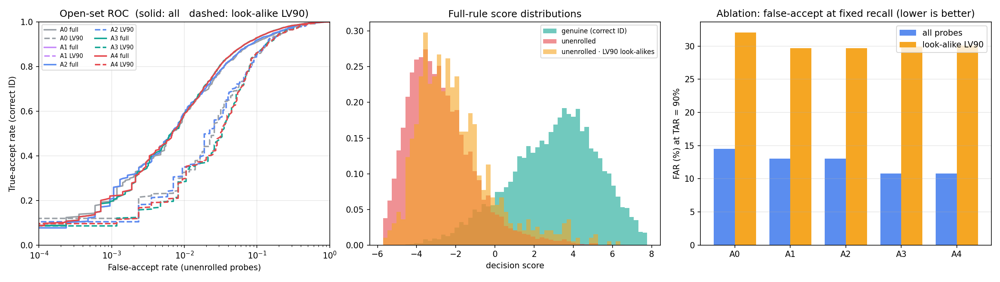
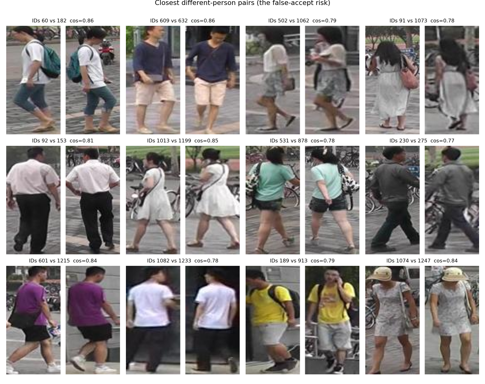
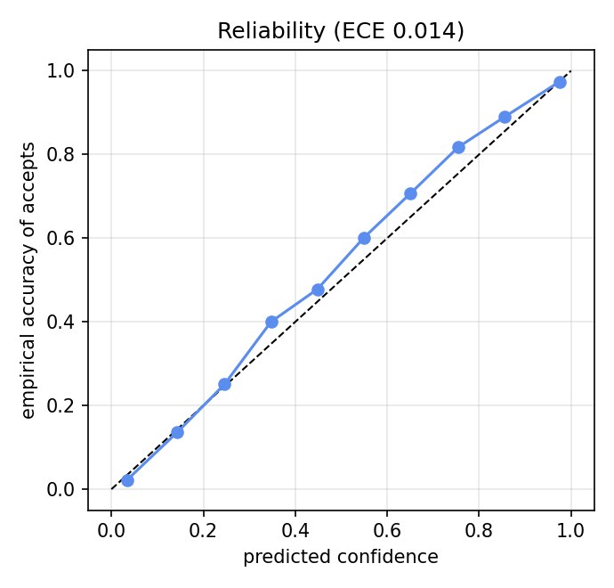
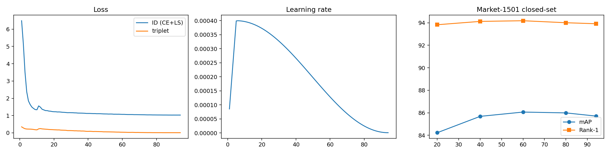

# Discern: Open-Set Person Re-Identification Under Low Inter-Class Appearance Variance

**Discern** is an open-set person re-identification (Re-ID) system engineered to suppress false accepts in environments where subjects exhibit low appearance variance (e.g. security officers, medical staff, warehouse staff, and factory workers in identical uniforms).

The deployment pipeline is powered by a **ResNet-50** backbone with last-stride-1, Generalized Mean (GeM) pooling, and BNNeck, outputting a 2048-dimensional L2-normalized embedding. The open-set decision engine combines horizontal flip test-time augmentation (TTA), multi-shot identity aggregation, competitive margin scoring to runner-up candidates, query-adaptive z-scores, and calibrated confidence thresholds.

---

## 1. Quick Start (Windows 11 / PowerShell)

### Installation & Environment Setup
Open PowerShell inside the repository directory:

```powershell
.\setup.ps1
```

This script:
1. Verifies Python 3.10+ and Node.js 18+ runtime environments.
2. Initializes the local virtual environment `.venv` and installs dependencies from `requirements.txt`.
3. Installs frontend dependencies in `frontend/`.
4. Verifies the ONNX model bundle at `model/`.

### Launching the Application
Open two PowerShell terminals:

**Terminal 1 — Backend API (FastAPI):**
```powershell
.\run_api.ps1
```
*API server runs on [http://localhost:8000](http://localhost:8000). Interactive Swagger documentation available at [http://localhost:8000/docs](http://localhost:8000/docs).*

**Terminal 2 — Frontend UI (React + Vite + Tailwind):**
```powershell
.\run_ui.ps1
```
*Web dashboard launches on [http://localhost:5173](http://localhost:5173).*

### CLI Verification Smoke Test
To verify the end-to-end model and decision engine without launching the UI:
```bash
python scripts/smoke_test.py
```
This loads the bundled demo gallery, evaluates probe images through `model/discern_embedder.onnx`, and prints verification metrics and probe latency.

---

## 2. API Endpoints

The FastAPI backend wraps `model/discern_inference.py` using ONNX Runtime (GPU if available, CPU fallback):

| Method | Endpoint | Description |
|---|---|---|
| `POST` | `/api/enroll` | Enroll one or more person crops under a named identity (`identity: str`, `images: UploadFile[]`). |
| `POST` | `/api/identify` | Identify a probe image against enrolled gallery (`image: UploadFile`, `op: strict \| balanced \| lenient`). On reject returns `UNKNOWN`. |
| `DELETE` | `/api/identity/{id}` | Remove an identity from gallery and rebuild embedding matrix. |
| `GET` | `/api/gallery` | List enrolled identities and counts of stored representations. |
| `GET` | `/api/config` | Returns `model/decision_config.json` (calibrators, features, operating thresholds). |
| `GET` | `/api/lookalikes` | Returns 60 hardest confusable distinct-person pairs from `model/lookalike_explorer.json`. |
| `GET` | `/api/metrics` | Returns full evaluation metrics from `model/reports/eval_report.json`. |
| `GET` | `/api/metrics/images` | Returns URLs for ROC curves, Look-Alike pairs, and calibration charts. |
| `POST` | `/api/demo/load` | Fast-loads bundled demo gallery from `model/demo/demo_manifest.json` and embeddings. |
| `POST` | `/api/demo/smoke-test` | Replays demo probe images and returns verification counts. |

Static files are served under `/static/samples`, `/static/demo/images`, and `/static/reports`.

---

## 3. Repository Layout

```
discern/
├── model/                                 # Trained Discern deployment bundle
│   ├── discern_embedder.onnx              # Primary ONNX embedder (Git LFS tracked)
│   ├── decision_config.json               # Calibrators, features, and operating points
│   ├── discern_inference.py               # ONNX Runtime inference class (Discern)
│   ├── lookalike_explorer.json            # 60 confusable pairs for visual explorer
│   ├── README_INTEGRATION.md              # Bundle specification contract
│   ├── demo/                              # Bundled demo gallery, probes, and embeddings
│   ├── reports/                           # Evaluation JSON, ablation tables, and plots
│   └── samples/                           # Crop samples for look-alike visualizer
├── backend/
│   └── app/
│       └── main.py                        # FastAPI application wrapping model/
├── frontend/                              # React + TypeScript + Vite dashboard
│   ├── src/
│   │   ├── pages/                         # Enroll, Match, LookAlikes, Evaluation
│   │   └── api.ts                         # Typed REST client
│   └── package.json
├── Notebook Scripts/
│   └── visionmodel.ipynb                  # Training & pipeline notebook
├── scripts/
│   └── smoke_test.py                      # Standalone CLI verification test
├── tests/
│   └── test_model_bundle.py               # Pytest suite for bundle and demo replay
├── requirements.txt                       # Core dependencies (onnxruntime, fastapi, etc.)
├── run_api.ps1                            # PowerShell launcher for backend
├── run_ui.ps1                             # PowerShell launcher for frontend
├── setup.ps1                              # PowerShell setup script
└── README.md
```

---

## 4. Scientific Results & Ablation Studies

*All numbers below are transcribed directly from `model/reports/eval_report.json`, `model/reports/ablation_inference.md`, `model/reports/ablation_training.md`, and `model/README_INTEGRATION.md`.*

### Closed-Set Market-1501 Benchmark
- **mAP**: **86.3%**
- **Rank-1**: **94.2%**
- **Rank-5**: **97.9%**
- **Rank-10**: **98.8%**
*(Evaluated with single query, horizontal flip-TTA, no re-ranking)*
- **Calibration Error (Held-Out Probes)**: **ECE 0.014**, Brier score 0.067

### Inference Ablation Study
Open-set protocol across full evaluation set and low-variance subsets (LV75 / LV90):

| Config | FAR@TAR90 full | FAR@TAR90 LV75 | FAR@TAR90 LV90 | TAR@FAR1% full | TAR@FAR1% LV90 | AUROC full | AUROC LV90 |
|---|---|---|---|---|---|---|---|
| **A0 baseline: single pass, max-sim, global threshold** | 14.5±3.3 | 23.0±9.2 | 32.1±26.8 | 54.1±14.7 | 44.0±20.5 | 0.9628 | 0.9422 |
| **A1 + flip test-time augmentation** | 13.0±3.8 | 19.4±6.8 | 29.7±26.8 | 54.9±14.9 | 46.4±22.4 | 0.9649 | 0.9446 |
| **A2 + multi-shot identity aggregation (max)** | 13.0±3.8 | 19.4±6.8 | 29.7±26.8 | 54.9±14.9 | 46.4±22.4 | 0.9649 | 0.9446 |
| **A3 + margin to runner-up identity [s1, margin]** | 10.8±3.2 | 18.8±8.1 | 29.9±25.6 | 58.0±15.1 | 44.3±24.6 | 0.9697 | 0.9409 |
| **A4 + query-adaptive z-score (full Discern rule)** | 10.8±3.2 | 18.4±8.5 | 30.1±26.0 | 57.7±14.5 | 43.0±23.6 | 0.9697 | 0.9402 |

### Training Recipe Ablation (30 Epochs)

| Training config (30 epochs) | mAP | R1 | FAR@TAR90 all | FAR@TAR90 LV90 | TAR@FAR1% LV90 |
|---|---|---|---|---|---|
| **T0 ID loss only (CE+LS)** | 83.5 | 93.5 | 14.92 | 49.05 | 47.4 |
| **T1 + batch-hard triplet** | 85.1 | 93.5 | 17.23 | 53.96 | 39.1 |
| **T2 + identity-level look-alike mining** | 85.0 | 94.1 | 13.64 | 37.82 | 38.3 |
| **T3 + EMA weights (full recipe)** | 85.1 | 93.9 | 14.59 | 31.66 | 38.0 |

### Calibrated Operating Points
Calibrator: `s1_margin_z` (features: top-candidate similarity $s_1$, competitive margin $m = s_1 - s_2$, query z-score $z = (s_1 - \mu_S)/\sigma_S$):

| Operating Point | Threshold | False-Accept Rate | Look-Alike (LV90) False-Accept | True-Accept Rate |
|---|---|---|---|---|
| **Strict** | 0.998 | 0.10% | 0.82% | 8.8% |
| **Balanced** | 0.963 | 0.99% | 5.46% | 51.4% |
| **Lenient** | 0.651 | 5.00% | 13.20% | 82.7% |

#### Visual Evaluation Plots

| Open-Set ROC & Ablation Curves | Look-Alike Confusable Pairs |
| :---: | :---: |
|  |  |

| Score Calibration & Reliability | Training Curves |
| :---: | :---: |
|  |  |

---

## 5. Honest Limitations

1. **Look-Alike Vulnerability**: Look-alike strangers are still falsely accepted much more often than ordinary strangers (e.g. at the balanced operating point, look-alike LV90 false-accept is 5.46% vs 0.99% overall).
2. **Gallery Size Sensitivity**: Thresholds were fitted with approximately 375 enrolled identities; gallery size shifts score distributions and order statistics, making the live operating-point selector necessary.
3. **Synthetic Look-Alike Proxy**: The colour-based look-alike subsets (LV75, LV90) are based on HSV appearance clustering across upper/lower body segments as a proxy for same-uniform cohorts, rather than a physically labelled same-clothing dataset.
4. **Dataset Scope**: The system was trained and evaluated on Market-1501 only. Cross-domain generalization to significantly distinct sensor optics or camera viewpoints may degrade calibration.
5. **No Absolute Guarantees**: Out-of-sample impostor distributions exhibit finite-sample variance; we report empirical realized rates rather than mathematical guarantees.

> [!NOTE]
> **Market-1501 is a research dataset; the dataset images are not redistributed in this repo.**

---

## 6. Testing

Run the automated test suite with pytest:

```powershell
.\.venv\Scripts\pytest.exe tests/test_model_bundle.py -v
```

This verifies:
- `decision_config.json` architecture, dimensions, and operating points.
- Bundled demo replay through `model/discern_inference.py`: confirms 40/40 known probes accepted, and reports the 2/40 look-alike false-accept rate as measured.
